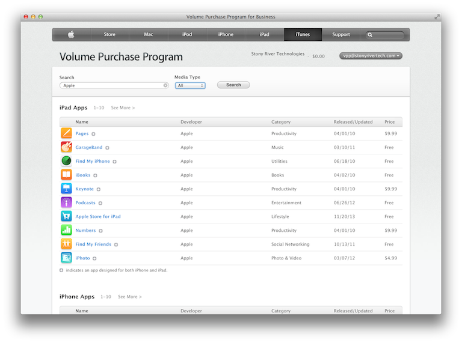

VPP 2.0
=======

---

VPP 2.0
=======

```whoami```

-	Justin Rummel
-	[@justinrummel](http://twitter.com/justinrummel)
-	[justin@stonyrivertech.com](mailto:justin@stonyrivertech.com)

---

Presentation available on GitHub
================================

.qr: 450|https://github.com/justinrummel/MacDMV/tree/master/VPP-2.0/

---


Agenda
======

-	What is VPP
-	VPP History (VPP 1.0)
-	VPP 2.0
	-	What can you do with VPPMD
	-	Who is allowed to use VPPMD
	-	Technical requirements for VPPMD
	-	Ethics

---

What is VPP
===========

What is VPP
-----------

>	The Volume Purchase Program store lets you purchase world-class App Store apps and engaging interactive books that are great for business. Purchase content in volume and equip your entire workforce with innovation - Apple, Inc.

This allows the potential for discount pricing, but depends on the developer.

---

What is VPP
-----------

>	The Volume Purchase Program store lets you purchase world-class App Store apps and engaging interactive books that are great for business. Purchase content in volume and equip your entire workforce with innovation - Apple, Inc.

What does this mean?
--------------------

I can buy a bunch of apps at once!

---

VPP 1.0
=======

---
What Apple recommended
======================

## Deployment Sceneries

-	Individual
-	Institutional
-	Layered

# Presenter Notes

Individual = Gift
Institutional = Apple Configurator
Layered = hot mess

---

Individual - VPP iTunes Store
=============================


---

Individual - VPP iTunes Store
=============================



---

Individual - VPP iTunes Store
=============================


---

Individual - VPP iTunes Store
=============================


---

Individual - VPP iTunes Store
=============================


---

Individual - Excel
==================


---

Institutional - iTunes
======================


# Presenter Notes

Be sure to Sign into iTunes store AND "Authorize This Computer".

---

Institutional - Apple Configurator
==================================


---

Layered
=======


---

3rd Party MDM
=============

Most 3rd Party MDM Vendors provided some solutions to make this easier

-	Tracking Capabilities
	*	Portal links
-	Ability to scope/target for groups
-	Help Manage Preferences
	*	Install immediate or prompt
	*	Remove if MDM Profile is removed
	*	Prevent data backup to iCloud

---

VPP 2.0
=======

Apple's new Deployment Model
============================

New Marketing terms in town

-	Personal (f.k.a Individual)
-	Shared Device Deployment (f.k.a Institutional)

# Presenter Notes

Notice Layered is dead... and that is good.

---

Shared Device Deployment
========================

There is no difference between VPP 1.0 and VPP 2.0 in terms of Shared Deployment

-	Still use iTunes to download all your apps
-	Still use Apple Configurator to install on your devices
-	Still can use the "1.0" method of downloading your VPP codes in an Excel sheet to import<sup>[1]</sup>

# NOTE
<sup>[1]</sup>Be sure **NOT** to promote your VPP Apple ID to use VPPMD.

---

VPP 2.0
=======

# Volume Purchasing Program Managed Distribution

# Presenter Notes

I have not seen in any official Apple documentation, but I've been referring this a VPPMD.

---

What can you do with VPPMD
==========================

-	You can purchase iOS Apps, Mac Apps and books in volume on a credit card (or pcard)
-	You can now send a end-user an email (which does not have to match their AppleID) that invites them to your VPPMD.
-	Once the user has joined your VPPMD, you can

---

What can you do with VPPMD
==========================

-	Silently "assign" apps on to end user devices!
-	"Revoke" previously installed apps (and their data<sup>[1]</sup>) on end user devices!
-	"Redistribute" apps that were previously assigned, and are now available as you have revoked a user's install of the app

# Note
<sup>[1]</sup>Depending on the developer, on remove a user may get a "trial" period to purchase the app and retain data.

---

Who is allowed to use VPPMD
===========================

You can sign up for VPP as:

-	Business<sup>[1]</sup>
-	Education<sup>[1]</sup>

<sup>[1]</sup> Sort of...

---

Who is allowed to use VPP
=========================

The Volume Purchase Program is available in the following countries:

-	Australia
-	Canada
-	France
-	Germany
-	Italy
-	Japan
-	New Zealand
-	Spain
-	United Kingdom
-	United States

Books are a completely different store.  Check w/ your Apple rep.

---

End User requirements for VPPMD
===============================

End User requirement

-	An iOS device running iOS 7 or later
-	A Mac running OS X 10.9 or later
-	All users must have an Apple ID in some fashion
	*	It doesn't make sense to force an Apple ID from your business or institution

---

Logistical requirements for VPPMD
=================================

-	Sign-up with VPP
	*	Business
		+	D-U-N-S number must be provided
		+	Email from your company
		+	Valid Business Address
	*	Education
		+	Email must be from your institution
		+	Find your institution
		+	Existing Apple customer number

---

Technical requirements for VPPMD
================================
-	Must have a directory system to lookup email addresses
-	Must have a MDM that can accept Apple's tokens
	*	Profile Manager
	*	Absolute
	*	Meraki
	*	JAMF (TBD)

# Presenter Notes
-	VPP Apple ID is unique to the VPP store.  Do not use it with iTunes or any other Apple Service.
-	Consumer email addresses will not be accepted (such as Gmail or Yahoo!
-	If you are thinking of doing both, you will have multiple VPP Apple IDs.  Plan now.

---

Warnings
========

Apple has limits in regards to Apple IDs

-	Your Apple ID can have up to 10 devices associated
-	You can authorize up to five computers
	*	Don't forget Apple Configurator / iTunes authorize relationship
-	You can only associate a credit card to five Apple IDs

---

Oops
====


---

Ethics
======

---

SOURCES
=======
-	Apple
	*	[http://www.apple.com/business/vpp/](http://www.apple.com/business/vpp/)
	*	[http://www.apple.com/education/it/vpp/](http://www.apple.com/education/it/vpp/)
	*	[http://support.apple.com/kb/ht4627](http://support.apple.com/kb/ht4627) (Apple ID's)
	*	[http://support.apple.com/kb/HT1420](http://support.apple.com/kb/HT1420) (Authorize or deauthorize your Mac or PC)
	*	[https://itunes.apple.com/us/app/apple-configurator/id434433123](https://itunes.apple.com/us/app/apple-configurator/id434433123) (App Store Link for Apple Configurator)
	*	[http://help.apple.com/configurator/mac/1.4.1/#](http://help.apple.com/configurator/mac/1.4.1/#) (Apple Configurator Help)
	*	[https://www.apple.com/education/docs/vpp_education_guide_en_Oct2013.pdf](https://www.apple.com/education/docs/vpp_education_guide_en_Oct2013.pdf) (Education)
	*	[https://www.apple.com/business/docs/vpp_business_guide_en_Oct2013.pdf](https://www.apple.com/business/docs/vpp_business_guide_en_Oct2013.pdf) (Business)

---

SOURCES
=======
-	Websites
	*	http://enterpriseios.com/story/2014/02/13/How_to_silently_push_free_apps_using_VPP,_Managed_Distribution,_Supervision_and_Air
	*	http://www.enterpriseios.com/story/2013/11/04/Apple_Launches_Managed_Distribution_for_App_Store_Volume_Purchase_Program_VPP_for_B
	*	http://macmule.com/2013/11/08/vpp-2-0-mavericks-ilife-13-iwork-13/
	*	http://macmule.com/2014/01/23/vpp-2-0-a-question-of-morality/
-	Images
	*	App Store, iTunes, Apple Configurator are images owned by Apple, Inc.
	*	Excel icon image owned by Microsoft

---

Thank You
=========
